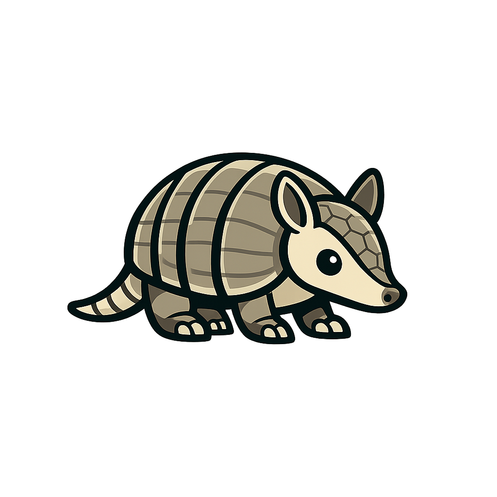

# catraquim

<p align="center">
  <strong>Gateway local que expõe Codex e Claude Code como uma API compatível com OpenAI.</strong>
</p>

<p align="center">
  Rode clientes e SDKs que falam OpenAI contra um servidor local, com configuração simples,
  aliases de modelos e documentação OpenAPI embutida.
</p>


<p align="center">
  <a href="https://github.com/Lucas-Delacroix/catraquim/blob/main/LICENSE"></a>
  = 20" />
  
  
  
</p>

## Visao geral

O `catraquim` funciona como uma camada HTTP local sobre CLIs de agentes, expondo endpoints no formato esperado por clientes compatíveis com OpenAI. Isso permite apontar ferramentas, scripts e integrações existentes para um `baseURL` local, sem reinventar o protocolo.

## Destaques

- API compatível com OpenAI para `chat completions` e listagem de modelos.
- Providers locais para Codex e Claude Code.
- Aliases de modelos configuráveis, desacoplando o nome exposto do nome real no provider.
- Documentação em `/docs` e especificação OpenAPI em `/openapi.json`.
- Middleware opcional com bearer token.
- Cabeçalhos HTTP defensivos em todas as respostas.
- CLI para inicializar, validar, editar e inspecionar a configuração.
- Base em TypeScript, Hono, Zod e Vitest.

## Sumario

- [Requisitos](#requisitos)
- [Instalacao](#instalacao)
- [Quick Start](#quick-start)
- [Comandos](#comandos)
- [Endpoints](#endpoints)
- [Configuracao](#configuracao)
- [Exemplo de uso](#exemplo-de-uso)
- [Desenvolvimento](#desenvolvimento)
- [Contribuindo](#contribuindo)
- [Licenca](#licenca)

## Requisitos

Antes de iniciar, garanta que o ambiente tenha:

- Node.js 20 ou superior
- `npm`, normalmente instalado junto com o Node.js
- `git`, para a instalacao rapida via script
- `pnpm`, opcional para instalacao manual ou desenvolvimento
- binario `codex` disponivel no `PATH`
- binario `claude` disponivel no `PATH`, se for usar Claude Code
- autenticacao valida em `~/.codex`
- autenticacao valida em `~/.claude`, se for usar Claude Code

## Instalacao

Instalacao rapida via script:

```bash
curl -fsSL https://raw.githubusercontent.com/Lucas-Delacroix/catraquim/main/scripts/install.sh | bash -s -- --install-method git
```

O script clona o repositorio em `~/.local/share/catraquim`, instala dependencias com `pnpm`, executa `pnpm build` e cria o binario `~/.local/bin/catraquim`. Se `pnpm` nao estiver instalado, o script tenta usar `corepack`; se tambem nao houver `corepack`, usa `npm exec pnpm@10.8.1`.

Instalacao manual a partir do checkout do repositorio:

```bash
pnpm install
pnpm build
```

## Quick Start

1. Gere a configuracao inicial:

```bash
catraquim config:init
```

2. Se preferir, abra o assistente interativo:

```bash
catraquim config:setup
```

3. Suba o gateway local:

```bash
catraquim start
```

4. Acesse a documentacao:

```text
http://127.0.0.1:4141/docs
```


Comandos disponiveis:

```bash
catraquim start
catraquim auth:status
catraquim config:init
catraquim config:setup
catraquim config:path
catraquim config:validate
catraquim config:edit
```

## Endpoints

| Metodo | Rota | Descricao |
| --- | --- | --- |
| `GET` | `/healthz` | Health check do gateway |
| `GET` | `/auth/status` | Status de autenticacao dos adapters configurados |
| `GET` | `/v1/models` | Lista de modelos expostos pelo gateway |
| `POST` | `/v1/chat/completions` | Chat completions no formato OpenAI |
| `GET` | `/openapi.json` | Especificacao OpenAPI |
| `GET` | `/docs` | Swagger UI |

## Configuracao

Arquivo padrao:

```text
~/.config/catraquim/config.json
```

Exemplo:

```json
{
  "server": {
    "host": "127.0.0.1",
    "port": 4141,
    "token": null
  },
  "models": {
    "claude-opus": {
      "adapter": "claude-code",
      "upstreamModel": "claude-opus-4-7"
    },
    "claude-sonnet": {
      "adapter": "claude-code",
      "upstreamModel": "claude-sonnet-4-6"
    },
    "codex-max": {
      "adapter": "codex",
      "upstreamModel": "gpt-5.4"
    },
    "codex-mini": {
      "adapter": "codex",
      "upstreamModel": "gpt-5.4-mini"
    }
  },
  "providers": {
    "claude-code": {
      "type": "claude-code",
      "binary": "claude",
      "homePath": "~/.claude"
    },
    "codex": {
      "type": "codex",
      "binary": "codex",
      "homePath": "~/.codex"
    }
  }
}
```

Notas:

- `codex-max`, `codex-mini`, `claude-opus` e `claude-sonnet` sao aliases do gateway. Ajuste `upstreamModel` se o seu ambiente usar outros nomes.
- O provider `claude-code` segue o mesmo padrao do OpenClaw: chama `claude -p --output-format stream-json` e limpa variaveis Anthropic/Claude herdadas para usar a autenticacao local do Claude Code.
- Se `server.host` nao for loopback (`localhost`, `127.0.0.1` ou `::1`), `server.token` e obrigatorio.
- Se `server.token` for definido, todas as rotas passam a exigir `Authorization: Bearer <token>`.
- CORS para clientes de navegador so e habilitado quando `server.token` esta definido; preflight `OPTIONS` e respondido antes da autenticacao bearer.
- Payloads HTTP acima de 10 MiB sao rejeitados com `413 payload_too_large`.
- Mensagens OpenAI com `role: "developer"` sao aceitas e tratadas como instrucoes de sistema internas.
- Requisicoes com `"stream": true` retornam a resposta no formato SSE (`text/event-stream`), compativel com clientes OpenAI.
- O parametro OpenAI `stop` e aceito como string, array de ate 4 strings ou `null`; quando informado, a resposta e cortada antes da primeira sequencia encontrada.
- Os parametros OpenAI `temperature`, `top_p`, `presence_penalty`, `frequency_penalty`, `response_format`, `tool_choice` e `user` sao aceitos no contrato HTTP; o efeito pratico depende do provider local configurado.
- O endpoint de chat completions suporta apenas uma escolha por requisicao; envie `n: 1` ou omita `n`.

Variaveis de ambiente suportadas:

- `CATRAQUIM_PORT`
- `CATRAQUIM_TOKEN`
- `CATRAQUIM_CODEX_BINARY`
- `CATRAQUIM_CLAUDE_CODE_BINARY`
- `CATRAQUIM_CLAUDE_BINARY`
- `LOG_LEVEL`
- `CATRAQUIM_LOG_FILE`
- `CATRAQUIM_LOG_MAX_BYTES`
- `CATRAQUIM_LOG_MAX_FILES`

Em `NODE_ENV=production`, o `catraquim` grava logs JSON em arquivo com rotacao por tamanho para evitar crescimento indefinido em disco. O caminho padrao e `${XDG_STATE_HOME:-~/.local/state}/catraquim/catraquim.log`, com limite de 10 MiB por arquivo e 5 arquivos rotacionados. Ajuste `CATRAQUIM_LOG_FILE`, `CATRAQUIM_LOG_MAX_BYTES` e `CATRAQUIM_LOG_MAX_FILES` conforme a retencao desejada. Defina `CATRAQUIM_LOG_MAX_FILES=0` para manter apenas o arquivo atual.

## Exemplo de uso

```bash
curl -X POST 'http://127.0.0.1:4141/v1/chat/completions' \
  -H 'content-type: application/json' \
  -d '{
    "model": "codex-max",
    "stream": false,
    "messages": [
      { "role": "user", "content": "Responda com uma frase curta." }
    ]
  }'
```

Se voce tiver configurado token:

```bash
curl -X POST 'http://127.0.0.1:4141/v1/chat/completions' \
  -H 'authorization: Bearer seu-token' \
  -H 'content-type: application/json' \
  -d '{
    "model": "codex-max",
    "stream": false,
    "messages": [
      { "role": "user", "content": "Liste tres usos para um gateway local." }
    ]
  }'
```

## Desenvolvimento

```bash
pnpm dev
pnpm test
pnpm check
pnpm build
```

Stack principal:

- TypeScript
- Hono
- Zod
- Vitest
- tsup

## Contribuindo

Issues e pull requests sao bem-vindos. Se for contribuir com codigo:

1. Abra uma issue ou descreva claramente o problema.
2. Mantenha as mudancas focadas.
3. Rode `pnpm test` e `pnpm check` antes de enviar.

## Licenca

Distribuido sob a licenca MIT. Veja [`LICENSE`](LICENSE) para mais detalhes.
